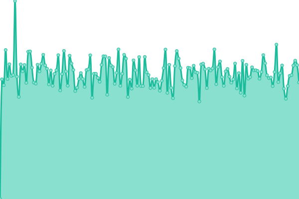
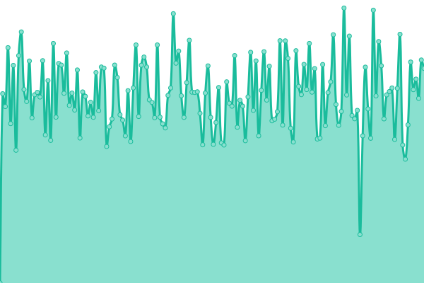
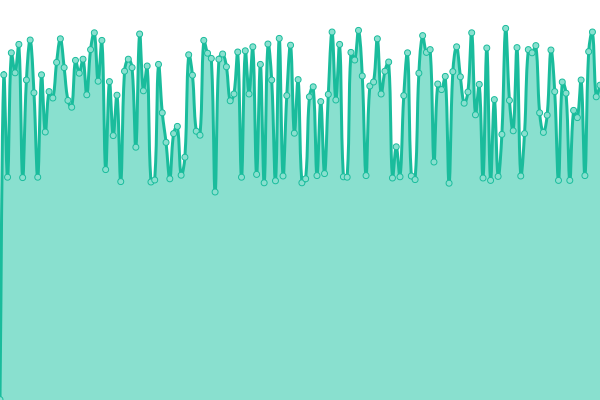
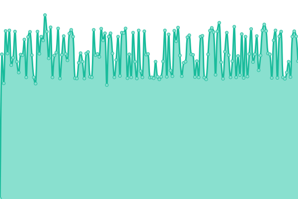
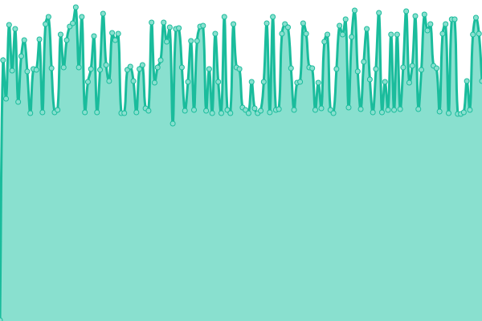
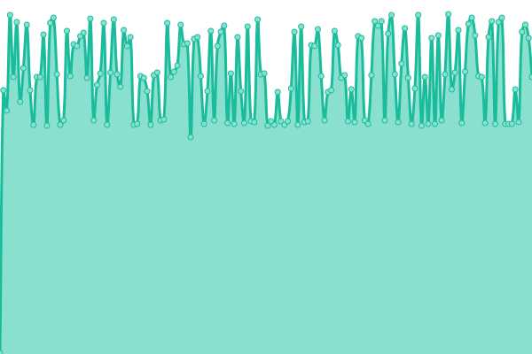
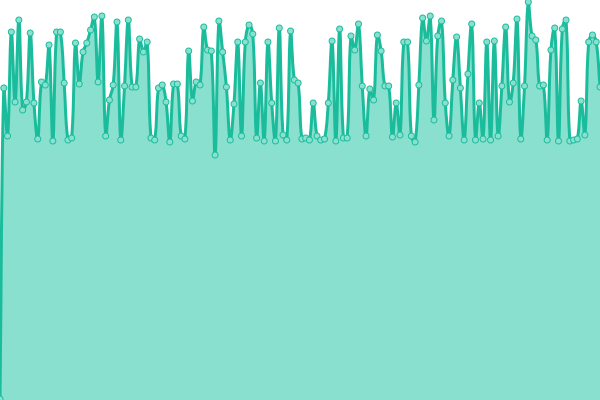

# [📈 Live Status](https://shin6949.github.io/company-site-uptime): <!--live status--> **🟧 Partial outage**

This repository contains the open-source uptime monitor and status page for [COCOBLUE](velog.io/shin6949), powered by [Upptime](https://github.com/upptime/upptime).

With [Upptime](https://upptime.js.org), you can get your own unlimited and free uptime monitor and status page, powered entirely by a GitHub repository. We use [Issues](https://github.com/shin6949/company-site-uptime/issues) as incident reports, [Actions](https://github.com/shin6949/company-site-uptime/actions) as uptime monitors, and [Pages](https://shin6949.github.io/company-site-uptime) for the status page.

<!--start: status pages-->
<!-- This summary is generated by Upptime (https://github.com/upptime/upptime) -->
<!-- Do not edit this manually, your changes will be overwritten -->
<!-- prettier-ignore -->
| URL | Status | History | Response Time | Uptime |
| --- | ------ | ------- | ------------- | ------ |
|  Company Homepage | 🟩 Up | [company-homepage.yml](https://github.com/shin6949/company-site-uptime/commits/HEAD/history/company-homepage.yml) | 

 1568ms
     
 | 

<a href="https://shin6949.github.io/company-site-uptime/history/company-homepage">100.00%</a>
    

|  Chatting Service | 🟩 Up | [chatting-service.yml](https://github.com/shin6949/company-site-uptime/commits/HEAD/history/chatting-service.yml) | 

 645ms
     
 | 

<a href="https://shin6949.github.io/company-site-uptime/history/chatting-service">100.00%</a>
    

|  Hub Service | 🟩 Up | [hub-service.yml](https://github.com/shin6949/company-site-uptime/commits/HEAD/history/hub-service.yml) | 

 828ms
     
 | 

<a href="https://shin6949.github.io/company-site-uptime/history/hub-service">100.00%</a>
    

|  Mail Portal Service | 🟩 Up | [mail-portal-service.yml](https://github.com/shin6949/company-site-uptime/commits/HEAD/history/mail-portal-service.yml) | 

 1193ms
     
 | 

<a href="https://shin6949.github.io/company-site-uptime/history/mail-portal-service">100.00%</a>
    

|  Docs Service | 🟥 Down | [docs-service.yml](https://github.com/shin6949/company-site-uptime/commits/HEAD/history/docs-service.yml) | 

 771ms
     
 | 

<a href="https://shin6949.github.io/company-site-uptime/history/docs-service">98.94%</a>
    

|  Share Service | 🟩 Up | [share-service.yml](https://github.com/shin6949/company-site-uptime/commits/HEAD/history/share-service.yml) | 

 1158ms
     
 | 

<a href="https://shin6949.github.io/company-site-uptime/history/share-service">100.00%</a>
    

|  Community Service | 🟩 Up | [community-service.yml](https://github.com/shin6949/company-site-uptime/commits/HEAD/history/community-service.yml) | 

 1991ms
     
 | 

<a href="https://shin6949.github.io/company-site-uptime/history/community-service">100.00%</a>
    

|  FTP Service | 🟩 Up | [ftp-service.yml](https://github.com/shin6949/company-site-uptime/commits/HEAD/history/ftp-service.yml) | 

 827ms
     
 | 

<a href="https://shin6949.github.io/company-site-uptime/history/ftp-service">100.00%</a>
    

|  OnlyOffice Service | 🟩 Up | [only-office-service.yml](https://github.com/shin6949/company-site-uptime/commits/HEAD/history/only-office-service.yml) | 

 737ms
     
 | 

<a href="https://shin6949.github.io/company-site-uptime/history/only-office-service">100.00%</a>
    

|  Collabora Service | 🟩 Up | [collabora-service.yml](https://github.com/shin6949/company-site-uptime/commits/HEAD/history/collabora-service.yml) | 

 581ms
     
 | 

<a href="https://shin6949.github.io/company-site-uptime/history/collabora-service">100.00%</a>
    

|  Registry Service | 🟩 Up | [registry-service.yml](https://github.com/shin6949/company-site-uptime/commits/HEAD/history/registry-service.yml) | 

 570ms
     
 | 

<a href="https://shin6949.github.io/company-site-uptime/history/registry-service">100.00%</a>
    

|  JAMA Service (TEST) | 🟩 Up | [jama-service-test.yml](https://github.com/shin6949/company-site-uptime/commits/HEAD/history/jama-service-test.yml) | 

 2169ms
     
 | 

<a href="https://shin6949.github.io/company-site-uptime/history/jama-service-test">100.00%</a>
    

|  JAMA Admin Console (TEST) | 🟩 Up | [jama-admin-console-test.yml](https://github.com/shin6949/company-site-uptime/commits/HEAD/history/jama-admin-console-test.yml) | 

 2111ms
     
 | 

<a href="https://shin6949.github.io/company-site-uptime/history/jama-admin-console-test">100.00%</a>
    

|  JAMA Airgap Service (TEST) | 🟩 Up | [jama-airgap-service-test.yml](https://github.com/shin6949/company-site-uptime/commits/HEAD/history/jama-airgap-service-test.yml) | 

 2162ms
     
 | 

<a href="https://shin6949.github.io/company-site-uptime/history/jama-airgap-service-test">74.49%</a>
    

|  JAMA Airgap Admin Console (TEST) | 🟩 Up | [jama-airgap-admin-console-test.yml](https://github.com/shin6949/company-site-uptime/commits/HEAD/history/jama-airgap-admin-console-test.yml) | 

 2142ms
     
 | 

<a href="https://shin6949.github.io/company-site-uptime/history/jama-airgap-admin-console-test">85.16%</a>
    

|  OpsHub Service (TEST) | 🟩 Up | [ops-hub-service-test.yml](https://github.com/shin6949/company-site-uptime/commits/HEAD/history/ops-hub-service-test.yml) | 

 483ms
     
 | 

<a href="https://shin6949.github.io/company-site-uptime/history/ops-hub-service-test">100.00%</a>
    

|  Retool Service (TEST) | 🟩 Up | [retool-service-test.yml](https://github.com/shin6949/company-site-uptime/commits/HEAD/history/retool-service-test.yml) | 

 708ms
     
 | 

<a href="https://shin6949.github.io/company-site-uptime/history/retool-service-test">100.00%</a>
    

|  CB 21.09 (TEST) | 🟩 Up | [cb-21-09-test.yml](https://github.com/shin6949/company-site-uptime/commits/HEAD/history/cb-21-09-test.yml) | 

 503ms
     
 | 

<a href="https://shin6949.github.io/company-site-uptime/history/cb-21-09-test">88.18%</a>
    

|  CB 22.10 (TEST) | 🟩 Up | [cb-22-10-test.yml](https://github.com/shin6949/company-site-uptime/commits/HEAD/history/cb-22-10-test.yml) | 

 523ms
     
 | 

<a href="https://shin6949.github.io/company-site-uptime/history/cb-22-10-test">100.00%</a>
    

|  CB 22.04 (TEST) | 🟩 Up | [cb-22-04-test.yml](https://github.com/shin6949/company-site-uptime/commits/HEAD/history/cb-22-04-test.yml) | 

 511ms
     
 | 

<a href="https://shin6949.github.io/company-site-uptime/history/cb-22-04-test">100.00%</a>
    

|  Air Qulity Bot | 🟩 Up | [air-qulity-bot.yml](https://github.com/shin6949/company-site-uptime/commits/HEAD/history/air-qulity-bot.yml) | 

 319ms
     
 | 

<a href="https://shin6949.github.io/company-site-uptime/history/air-qulity-bot">100.00%</a>
    

|  Servicer Bot | 🟩 Up | [servicer-bot.yml](https://github.com/shin6949/company-site-uptime/commits/HEAD/history/servicer-bot.yml) | 

 319ms
     
 | 

<a href="https://shin6949.github.io/company-site-uptime/history/servicer-bot">100.00%</a>
    

|  Daily Journal Bot | 🟩 Up | [daily-journal-bot.yml](https://github.com/shin6949/company-site-uptime/commits/HEAD/history/daily-journal-bot.yml) | 

 319ms
     
 | 

<a href="https://shin6949.github.io/company-site-uptime/history/daily-journal-bot">100.00%</a>
    

|  Draw Bot | 🟩 Up | [draw-bot.yml](https://github.com/shin6949/company-site-uptime/commits/HEAD/history/draw-bot.yml) | 

 319ms
     
 | 

<a href="https://shin6949.github.io/company-site-uptime/history/draw-bot">100.00%</a>
    

|  Remind Bot | 🟩 Up | [remind-bot.yml](https://github.com/shin6949/company-site-uptime/commits/HEAD/history/remind-bot.yml) | 

 319ms
     
 | 

<a href="https://shin6949.github.io/company-site-uptime/history/remind-bot">100.00%</a>
    

|  Info Bot | 🟩 Up | [info-bot.yml](https://github.com/shin6949/company-site-uptime/commits/HEAD/history/info-bot.yml) | 

 318ms
     
 | 

<a href="https://shin6949.github.io/company-site-uptime/history/info-bot">100.00%</a>
    

|  Openplay Bot | 🟩 Up | [openplay-bot.yml](https://github.com/shin6949/company-site-uptime/commits/HEAD/history/openplay-bot.yml) | 

 318ms
     
 | 

<a href="https://shin6949.github.io/company-site-uptime/history/openplay-bot">100.00%</a>
    

<!--end: status pages-->

[**Visit our status website →**](https://shin6949.github.io/company-site-uptime)

## 📄 License

- Powered by: [Upptime](https://github.com/upptime/upptime)
- Code: [MIT](./LICENSE) © [COCOBLUE](velog.io/shin6949)
- Data in the `./history` directory: [Open Database License](https://opendatacommons.org/licenses/odbl/1-0/)
